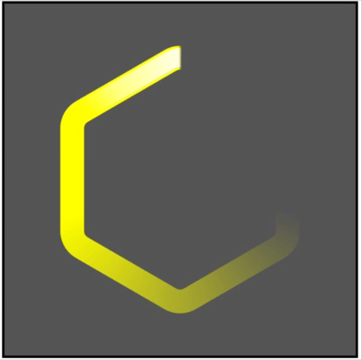
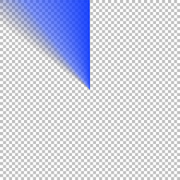
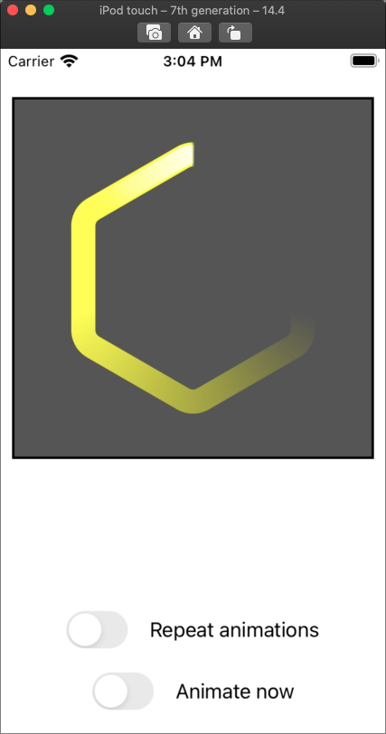

## PolarGradientMaskView

This project illustrates how to use a "conic" gradient to mask a view and create a circular animation that looks like this:

It uses a `CAGradientLayer` of type `.conic`, set up to be mostly opaque, with the last half transitioning to transparent. It installs the gradient layer as a mask on a shape layer that contains a yellow Hexagon.

The gadient layer looks like this:

(Rendered in blue against a gray checkerboard background so you can see the transition from opaque to clear.)

The opaque (blue) parts of the gradient cause the shape layer to be visible. The transparent parts of the gradient hide (mask) those parts of the shape layer, and partly transparent parts of the gradient layer make those parts of the shape layer partly transparent.

This version of the project adds a second shape layer on top of the first, drawn in white (to create a highlight on the leading edge of the animation.) The second shape layer has a slightly smaller line width.

The mask for the second shape layer is also a conical gradient layer, but the mask masks out most of the highlight shape layer. It only exposes a small part of the white highlight layer at the leading edge, and the highlight mask layer is never fully opaque.

The hightlight mask gradient looks like this: (Again in blue against a checkerboard background so you can see the opaque and transparent bits. Note that you can see the checkerboard through the blue in the entire gradient since it is never fully opaque.

The animation simply rotates both gradient layers on the Z axis around the center of the layers. It rotatest the layers 1/4 turn at a time, and each time an animation step completes, it simply creates a new animation that rotates the masks another 1/4 turn.

The app's window looks like this:

