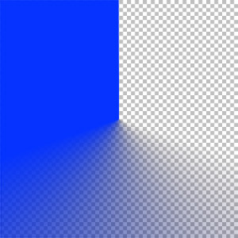

##PolarGradientMaskView

This project illustrates how to use a "conic" gradient to mask a view and create a circular animation that looks like this:

It uses a `CAGradientLayer` of type `.conic`, set up to be mostly opaque, with the last half transitioning to transparent. It installs the gradient layer as a mask on a shape layer that contains a yellow Hexagon.

The gadient layer looks like this:

(Rendered in blue against a gray checkerboard background so you can see the transition from opaque to clear.)

The animation simply rotates the gradient layer on the Z axis around the center of the layer. It rotatest the layer 1/4 turn at a time, and each time an animation step completes, it simply creates a new animation that rotates the mask another 1/4 turn.

The app's window looks like this:

